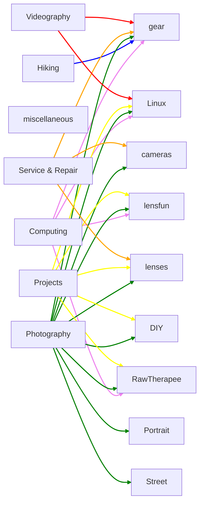

<b>martbetz.github.io</b>

The following graph illustrates the category/tag relationship for website posts.

```mermaid

    graph LR
   
    A["Computing"] --> 4["gear"]
    A["Computing"] --> 5["lensfun"]
    A["Computing"] --> 6["Linux"]
    A["Computing"] --> 9["RawTherapee"]
    
    B["Hiking"] --> 4["gear"]
    
    C["miscellaneous"]
    
    D["Photography"] --> 1["cameras"]
    D["Photography"] --> 2["DIY"]
    D["Photography"] --> 3["lenses"]
    D["Photography"] --> 4["gear"]
    D["Photography"] --> 5["lensfun"]
    D["Photography"] --> 6["Linux"]
    D["Photography"] --> 7["Portrait"]
    D["Photography"] --> 8["Street"]
    D["Photography"] --> 9["RawTherapee"]
    
    E["Projects"] --> 2["DIY"]
    E["Projects"] --> 3["lenses"]
    E["Projects"] --> 5["lensfun"]
    E["Projects"] --> 6["Linux"]
    E["Projects"] --> 9["RawTherapee"]
    
    F["Service & Repair"] --> 1["cameras"]
    F["Service & Repair"] --> 3["lenses"]
    F["Service & Repair"] --> 4["gear"]
    
    G["Videography"] --> 4["gear"]
    G["Videography"] --> 6["Linux"]
    
    linkStyle 0 stroke-width:2px,fill:none,stroke:violet;
    linkStyle 1 stroke-width:2px,fill:none,stroke:violet;
    linkStyle 2 stroke-width:2px,fill:none,stroke:violet;
    linkStyle 3 stroke-width:2px,fill:none,stroke:violet;
    linkStyle 4 stroke-width:2px,fill:none,stroke:blue;
    linkStyle 5 stroke-width:2px,fill:none,stroke:green;
    linkStyle 6 stroke-width:2px,fill:none,stroke:green;
    linkStyle 7 stroke-width:2px,fill:none,stroke:green;
    linkStyle 8 stroke-width:2px,fill:none,stroke:green;
    linkStyle 9 stroke-width:2px,fill:none,stroke:green;
    linkStyle 10 stroke-width:2px,fill:none,stroke:green;
    linkStyle 11 stroke-width:2px,fill:none,stroke:green;
    linkStyle 12 stroke-width:2px,fill:none,stroke:green;
    linkStyle 13 stroke-width:2px,fill:none,stroke:green;
    linkStyle 14 stroke-width:2px,fill:none,stroke:yellow;
    linkStyle 15 stroke-width:2px,fill:none,stroke:yellow;
    linkStyle 16 stroke-width:2px,fill:none,stroke:yellow;
    linkStyle 17 stroke-width:2px,fill:none,stroke:yellow;
    linkStyle 18 stroke-width:2px,fill:none,stroke:yellow;
    linkStyle 19 stroke-width:2px,fill:none,stroke:orange;
    linkStyle 20 stroke-width:2px,fill:none,stroke:orange;
    linkStyle 21 stroke-width:2px,fill:none,stroke:orange;
    linkStyle 22 stroke-width:2px,fill:none,stroke:red;
    linkStyle 23 stroke-width:2px,fill:none,stroke:red; 
```

